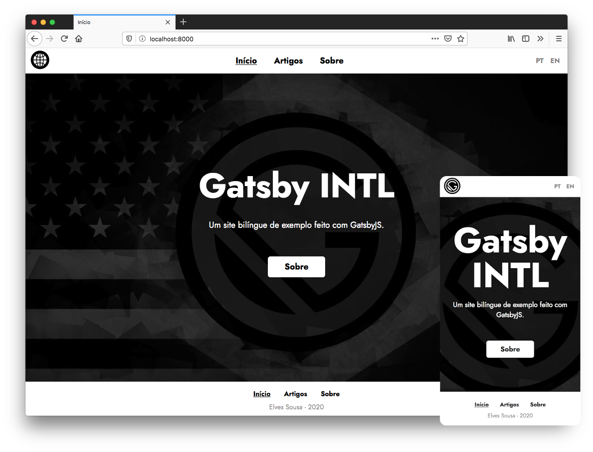

    
    <h1 align="center" style="margin: 0;">
        
        Gatsby INTL
        
    </h1>

     

## Sobre

Site feito para mostrar a criação de um site bilíngue utilizando o
Gatsby JS. O tutorial está em um artigo do meu blog. Fique a
vontade para ver o código-fonte, fazer um fork, ou até usá-lo em
seus projetos.

---

## Plugins utilizados

Esse projeto foi desenvolvido utilizando as extensões abaixo:

- gatsby-plugin-intl
- gatsby-plugin-web-font-loader
- gatsby-source-filesystem
- gatsby-transformer-remark

---

## Como contribuir

- Crie um fork deste repositório
- Faça uma branch com a sua feature: `git checkout -b minha-feature`;
- Envie suas alterações: `git commit -m 'feat: Minha nova feature'`;
- Faça um push para a sua branch: `git push origin minha-feature`.
