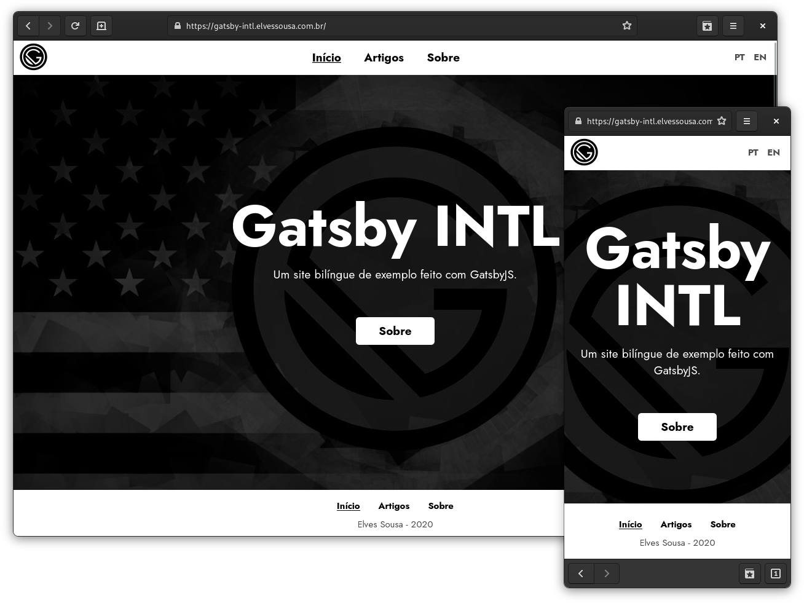

<h1 align="center">
    
    
    Gatsby INTL
    
</h1>

## About

Site made to showcase the creation of a bilingual website using Gatsby
JS. The tutorial is in an article on my blog. Feel free to view
the source code, fork it, or even use it in your projects.

---

## Plugins utilizados

This project was developed using the plugins below:

- gatsby
- gatsby-plugin-intl
- gatsby-plugin-web-font-loader
- gatsby-source-filesystem
- gatsby-transformer-remark

---

## How to contribute

- Fork this repo
- Create a branch with your feature: `git checkout -b my-feature`;
- Commit your modifications: `git commit -m 'feat: My new feature'`;
- Push it to your branch: `git push origin my-feature`.
